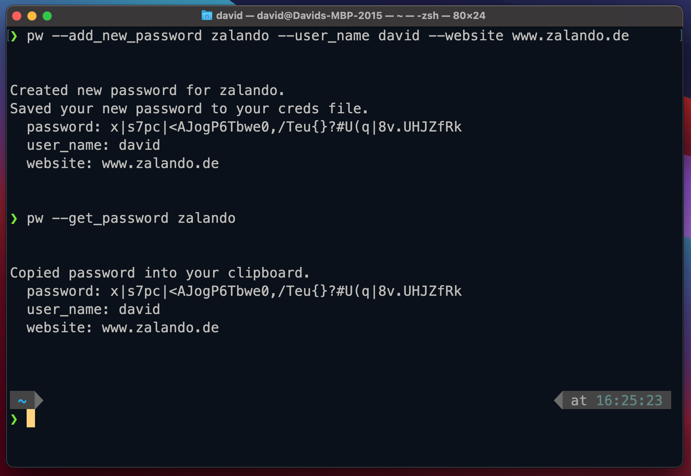

# Get passwords into your clipboard from the terminal.



### Features: 

You can run the script `pw_command.py` to manage your passwords in the command line. See the explanation
for the commands below. Here is what this tool can do:

- Copy passwords from a json file into clipboard
- Generate a random password with a length of 42 characters and save it to the json file as a new password
- Add a new random password from your command line into the creds.json file and copy into clipboard

### How I set it up:

I create a symlink to the python script `pw_command.py` (command 2). The name of this symlink is just "pw".
The symlink needs execution permissions (command 3). The symlink needs to be in a folder that is listed
in PATH. In my case, that's the folder `.bin` which exists in my home directory.

1. `mkdir ~/.bin/ && cd ~/.bin/`
2. `ln -s ~/dev/python_pw_cli/src/pw_command.py pw`
3. `chmod +x pw`

Furthermore, you need to assure two things:

1. Update line 1 of `pw_command.py` by specifying your path to Python3 (find out with `which python3`)
2. Create a passwords.json somewhere and pass the path to the variables in `pw_config.py` accordingly 


### Commands:

- `pw -g <name>` -> Get the password of `<name>` from the section main
- `pw -as` -> Print all available sections
- `pw -s <section>` -> Print all available entities of the given section
- `pw -gs <name> <section>` -> Get the password of `<name>` from `<section>`
- `pw -r` -> Generate a random password with 42 characters, print it and copy it to the clipboard
- `pw -n <name>` -> Add a new randomly created password to the creds.json file for the entity `<name>`  

### Todo:

- Optionally, but additionally to the password, update the json with a username and a website. 
  How can I pass optionally add more args to "-n"?
- Encrypt / Decrypt creds file
- copy username into clipboard
- check what additional information is available on the service
- Find a better name for "service". What explains the "entity" that you need the password for?
- Further crud operations:
    - Add new password 
    - Update existing password
    - Remove pw


Storing information on passwords:

```
"section": {
        "key": {
            "password": "lorem",
            "user_name": "ipsum",
            "website": "www.website.swiss"
            "additional_info": "..."
        }
    }
```
